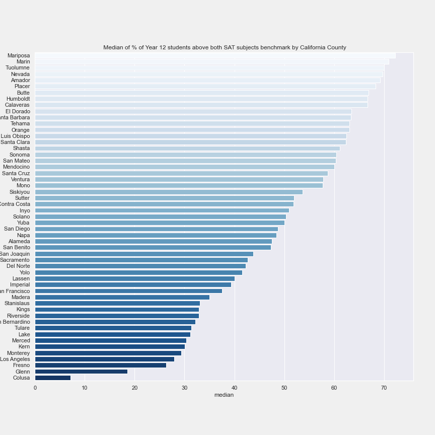
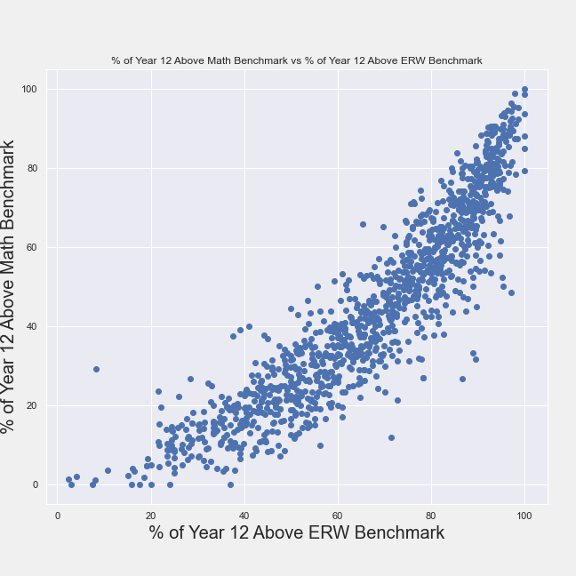
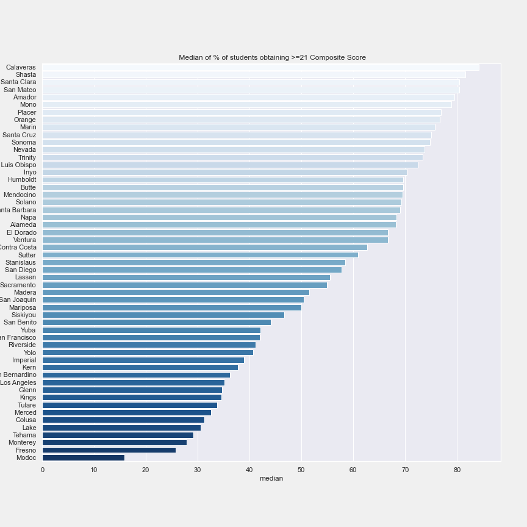
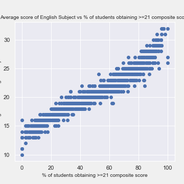
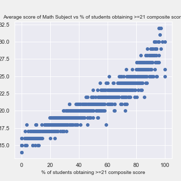
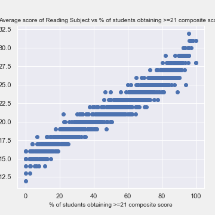
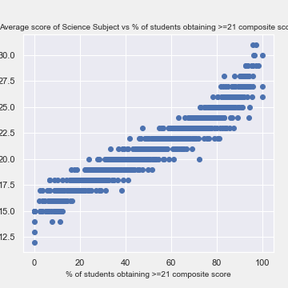

#  Project 1: Standardized Test Analysis

## Problem Statement

As majority of California schools enrolled their students in SAT or ACT test, this project aims to identify insights from graduated students’ performance in the 2019 SAT and ACT tests. And hence to provide recommendations to government to improve college admission test results of students, so as to improve the college enrollment rates.

## Background

As education policy advisor for the government of California in the year 2020, I am tasked to look for ways to increase college enrollments, and one aspect to do so is to improve the college admission test results of students. 

### California State
1. According to [US Census Bureau](#[https://www.census.gov/quickfacts/CA](https://www.census.gov/quickfacts/CA)), California State is the highest population state (~39.5 million, ~12% of US population). 
2. And every year there will be [~420,000 high school graduates](#https://nces.ed.gov/programs/digest/d16/tables/dt16_219.20.asp) in California.
3. However, there are only [63%](#https://edpolicyinca.org/sites/default/files/Statewide%20NSC%20Report%20Final%20Online.pdf) of high school students in California able to enroll into college.

 ### College Admission Test

- Most California schools enrolled their students in taking SAT Test [(63%)](#https://blog.prepscholar.com/average-sat-scores-by-state-most-recent) and / or ACT test [(23%)](#https://blog.prepscholar.com/act-scores-by-state-averages-highs-and-lows).

- In SAT Exam, 2 subjects are to be taken by registered students, which are [Evidence-based Reading and Writing (ERW) and Mathematics](#https://collegereadiness.collegeboard.org/sat/inside-the-test). And to assess the students' readiness for college, SAT Board have published a College and Career Readiness benchmark scores for both subjects [(ERW >= 480, Math >=530)](#https://collegereadiness.collegeboard.org/about/scores/benchmarks). Students with scores >= College and Career Readiness benchmark scores will have a 75% chance of earning at least a C in 1st semester in college for credit bearing courses.
 
- In ACT Exam, 4 subjects are to be taken by registered students, which are [English, Math, Reading, Science](#https://www.act.org/content/act/en/products-and-services/the-act/scores/understanding-your-scores.html). ACT has a composite score to assess the students, and in recent years, [ACT Composite score = 21](#https://blog.prepscholar.com/what-is-a-good-act-score-a-bad-act-score-an-excellent-act-score) is the benchmark where students with this composite score is at the 50th percentile of all test takers.

## Brief Summary of Analysis

### SAT Test

<ins>County Analysis</ins>

Among the 53 counties in California, observe the bottom 5 counties in terms of median % of Year 12 students achieving scores above benchmarks for both subjects are Colusa, Glenn, Fresno, Los Angeles, and Monterey.

<ins>Subject Analysis</ins>

Based on a correlation study between % of Year 12 above math benchmark vs % of Year 12 above ERW benchmark, observe a strong +ve linear correlation, indicating that students with weak ERW background could possibly have weak Math background as well. 

It is also observed that % of Year 12 above benchmark for Math subject is always smaller than % of Year 12 above benchmark for ERW, suggesting that students are weaker in Math generally.

### ACT Test

<ins>County Analysis</ins>

Among the 53 counties in California, observe the bottom 5 counties in terms of median % of students obtaining >=21 composite scores are  Modoc, Fresno, Monterey, Tehama, and Lake.

<ins>Subject Analysis</ins>

Observed that all 4 subjects shows strong +ve linear correlation to % of students obtaining >=21 composite score, suggesting that to increase the % of students obtaining >=21 composite scores, all the 4 subjects are equally important.

## Conclusions/Recommendations

### SAT Test

<ins>County Analysis</ins>

Government can focus on allocating more and higher quality teaching resources to the bottom 5 counties (Colusa, Glenn, Fresno, Los Angeles and Monterey) in urgent need.

<ins>Subject Analysis</ins>

For students in need, the state will need to provide additional or higher quality teaching resources for both Math and ERW subjects. Throughout the state, government need to improve quality of current teaching resources in Math.

### ACT Test

<ins>County Analysis</ins>

Government can focus on allocating more and higher quality teaching resources to the bottom 5 counties in ACT performance, namely Modoc, Fresno, Monterey, Tehama and Lake.

<ins>Subject Analysis</ins>

For students in need, the state will need to provide additional or higher quality teaching resources for all 4 subjects (Math, English, Reading, Science).
